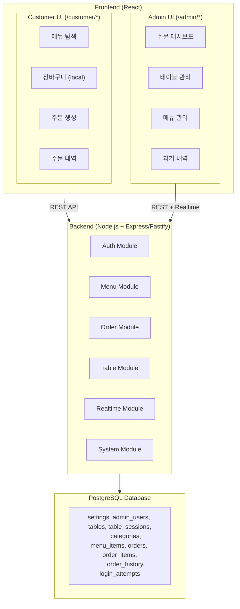

# 테이블오더 서비스 - Application Design (통합)

---

## 1. 아키텍처 개요



---

## 2. 기술 결정 사항

| 항목 | 결정 |
|------|------|
| 백엔드 구조 | 도메인별 모듈 + 내부 레이어 분리 (routes/controller/service/repository) |
| 프론트엔드 | 단일 React 앱, /customer와 /admin 라우팅 분리 |
| API 통신 | REST API (CRUD) + Realtime (실시간) |
| 데이터 접근 | Raw SQL (pg 드라이버 직접 사용) |
| 상태 관리 | React 내장 (useState/useContext) |
| 이미지 저장 | 서버 로컬, uploads/images/{category}/ 구조 |
| 인증 | JWT (관리자), 테이블 토큰 (고객 태블릿) |
| 프로젝트 구조 | 모노레포 |
| 컨테이너 | Docker |

---

## 3. 모노레포 구조 (예상)

```
table-order/
  packages/
    frontend/          # React 앱 (고객 + 관리자)
    backend/           # Node.js API 서버
      src/
        modules/
          auth/        # routes, controller, service, repository
          menu/
          order/
          table/
          realtime/
          system/
        middleware/
        config/
        db/
  docker-compose.yml
  package.json         # 모노레포 루트
```

---

## 4. 컴포넌트 요약

- **6개 백엔드 모듈**: Auth, Menu, Order, Table, Realtime, System
- **2개 프론트엔드 영역**: Customer UI, Admin UI (단일 앱 내 라우팅 분리)
- **9개 DB 테이블**: settings, admin_users, tables, table_sessions, categories, menu_items, orders, order_items, order_history
- **1개 보조 DB 테이블**: login_attempts (로그인 시도 제한용)

---

## 5. 핵심 서비스 협력

- **OrderService → TableService**: 주문 생성 시 활성 테이블 세션 확인
- **OrderService → RealtimeService**: 주문 생성/상태 변경/삭제 시 실시간 이벤트 (broadcast)
- **TableService → RealtimeService**: 이용 완료 시 대시보드 업데이트 이벤트 (broadcast)

---

## 6. 상세 참조

- 컴포넌트 정의: [components.md](components.md)
- 메서드 시그니처: [component-methods.md](component-methods.md)
- 서비스 설계: [services.md](services.md)
- 의존성 관계: [component-dependency.md](component-dependency.md)
