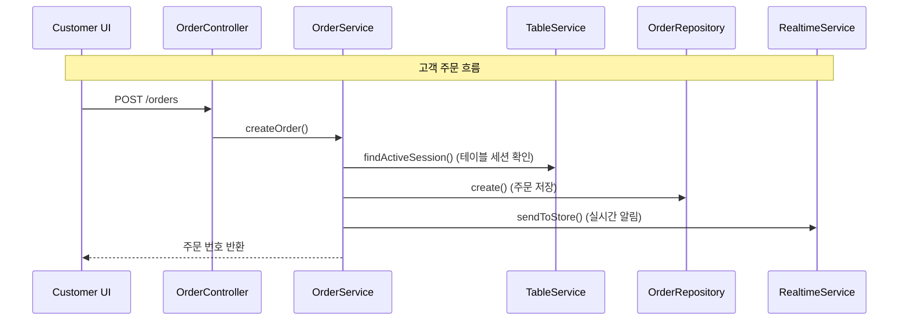
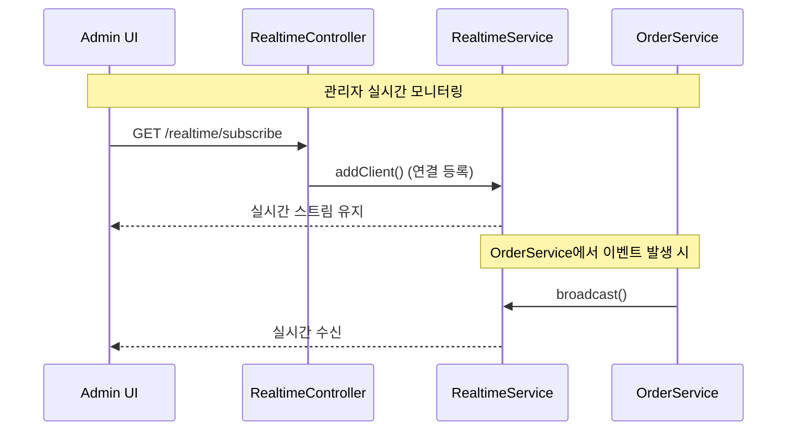
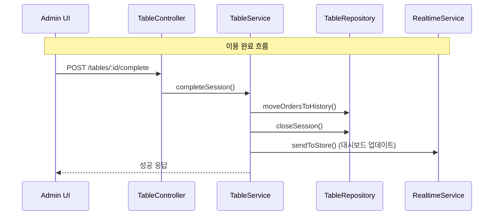
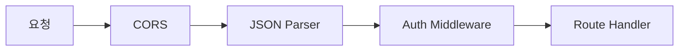

# 테이블오더 서비스 - 컴포넌트 의존성

---

## 의존성 매트릭스

| 호출자 (→) | AuthService | MenuService | OrderService | TableService | RealtimeService | SystemService |
|------------|:-----------:|:-----------:|:------------:|:------------:|:----------:|:-------------:|
| AuthService | - | | | | | |
| MenuService | | - | | | | |
| OrderService | | | - | ✅ | ✅ | |
| TableService | | | | - | ✅ | |
| RealtimeService | | | | | - | |
| SystemService | | | | | | - |

- ✅ = 의존 관계 있음

---

## 통신 패턴

### Frontend → Backend
- **REST API** (HTTP): 모든 CRUD 작업
  - Customer UI → Auth, Menu, Order API
  - Admin UI → Auth, Menu, Order, Table API
- **Realtime** (단방향 스트림): 실시간 업데이트
  - Admin UI ← Realtime 엔드포인트 (신규 주문, 상태 변경)
  - Customer UI ← Realtime 엔드포인트 (주문 상태 변경, 선택사항)

### Backend 내부
- Controller → Service → Repository (동기 호출)
- Service → Service (모듈 간 협력, 동기 호출)
- Service → RealtimeService (이벤트 발행, fire-and-forget)

---

## 데이터 흐름

---

## 미들웨어 체인

Auth Middleware 적용:
- 관리자 API: JWT 검증 필수
- 고객 API: 테이블 토큰 검증 필수
- 공개 API: 인증 불필요 (관리자 로그인, 테이블 로그인)
- Realtime: JWT 검증 필수 (관리자만)
