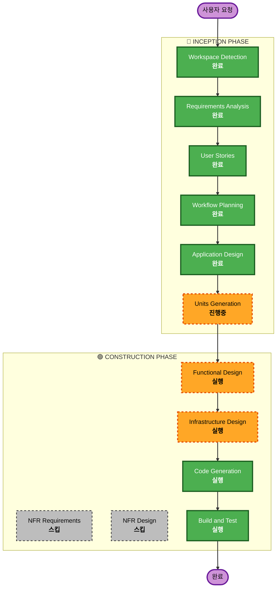

# Execution Plan

## 상세 분석 요약

### 변경 영향 평가
- **사용자 대면 변경**: Yes - 고객 주문 UI + 관리자 대시보드 (2개 인터페이스)
- **구조적 변경**: Yes - 프론트엔드(React) + 백엔드(Node.js) + DB(PostgreSQL) 신규 구축
- **데이터 모델 변경**: Yes - 매장, 테이블, 메뉴, 주문, 세션, 주문이력 스키마 신규 설계
- **API 변경**: Yes - REST API 전체 신규 설계 (인증, 메뉴, 주문, 테이블, Realtime)
- **NFR 영향**: Yes - Realtime 통신, JWT 인증, 동시 접속 처리

### 리스크 평가
- **리스크 수준**: Medium
- **롤백 복잡도**: Easy (신규 프로젝트, 기존 시스템 없음)
- **테스트 복잡도**: Moderate (Realtime, 세션 관리, 다중 인터페이스)

---

## 워크플로우 시각화



### 텍스트 대안 (Mermaid 렌더링 실패 시)

```
🔵 INCEPTION PHASE
  [완료] Workspace Detection
  [완료] Requirements Analysis
  [완료] User Stories
  [완료] Workflow Planning
  [완료] Application Design
  [진행중] Units Generation

🟢 CONSTRUCTION PHASE (유닛별 반복)
  [실행] Functional Design
  [스킵] NFR Requirements
  [스킵] NFR Design
  [실행] Infrastructure Design
  [실행] Code Generation
  [실행] Build and Test

🟡 OPERATIONS PHASE
  [플레이스홀더] Operations
```

---

## 실행할 단계

### 🔵 INCEPTION PHASE
- [x] Workspace Detection (완료)
- [x] Requirements Analysis (완료)
- [x] User Stories (완료)
- [x] Workflow Planning (완료)
- [x] Application Design (완료)
- [x] Units Generation (완료)

### 🟢 CONSTRUCTION PHASE (유닛별 반복)
- [ ] Functional Design - 실행
  - **근거**: 데이터 모델(매장/테이블/메뉴/주문/세션/이력), 비즈니스 규칙(세션 라이프사이클, 주문 상태 전이), API 엔드포인트 상세 설계 필요.
- [ ] NFR Requirements - 스킵
  - **근거**: 소규모 MVP(10개 이하 테이블), Security Extension 비활성화, 프로토타입 수준. NFR은 요구사항에 이미 정의된 수준(Realtime, JWT, bcrypt)으로 충분.
- [ ] NFR Design - 스킵
  - **근거**: NFR Requirements 스킵에 따라 자동 스킵.
- [ ] Infrastructure Design - 실행
  - **근거**: Docker 컨테이너 배포 설계, 모노레포 빌드 구조, 서비스 간 네트워킹 정의 필요.
- [ ] Code Generation - 실행 (필수)
  - **근거**: 구현 계획 수립 및 코드 생성.
- [ ] Build and Test - 실행 (필수)
  - **근거**: 빌드 및 테스트 지침 생성.

### 🟡 OPERATIONS PHASE
- [ ] Operations - 플레이스홀더 (향후 확장)

---

## 성공 기준
- **주요 목표**: 단일 매장용 테이블오더 MVP 완성 (고객 주문 + 관리자 모니터링)
- **핵심 산출물**: React 프론트엔드 2개, Node.js 백엔드 API, PostgreSQL 스키마, Docker 설정
- **품질 기준**: 모든 유저스토리의 Acceptance Criteria 충족, Realtime 통신 동작, JWT 인증 동작
